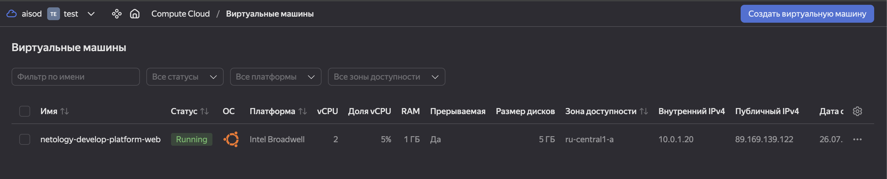
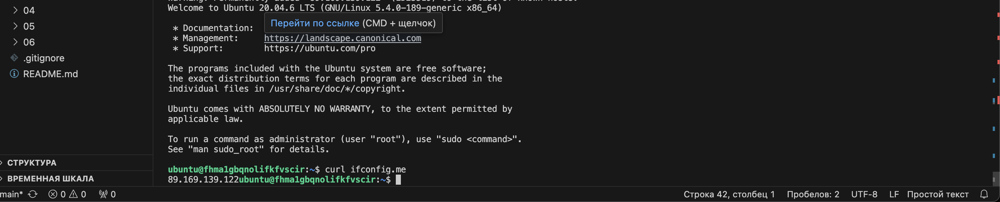

#### Задание #1

исправленные ошибки в процессе запуска:
```
│ Error: Error while requesting API to create network: server-request-id ... Quota limit vpc.networks.count exceeded ... resource "yandex_vpc_network" "develop" {
```
ограничение yandex-cloud на количество сетей

```
│ Error: No value for required variable ...
│    2: variable "token" {
```
не было заданного значения у переменной

```
│ Error: Invalid function argument ... 
service_account_key_file = file("~/.authorized_key.json")
```
не было файла с ключом


```
│ Error: Error while requesting API to create instance: server-request-id ...Platform "standart-v4" not found
```
нет платформы с таким названием yandex-cloud


```
 Error: Error while requesting API to create instance: server-request-id = allowed core number: 2, 4
```
в yandex-cloud количество ядер у instance не может быть == 1


Итоговый результат:




#### Задания #1-6

В рамках реализации заданий в директории ./src были созданы дополнительно variables.tf outputs.tf vms_platform.tf , а также добавлены terraform.tfvars vms_platform.tf В данные файлы внесены изменения в с соответствии с заявленными требованиями по пп. 1-6

ДОПОЛНИТЕЛЬНО по части хардкода было исправлено:
В resource "yandex_compute_instance" была захадкожена zone.
В provider "yandex" жестко закодирован путь к файлу service_account_key_file.

#### дополнительное Задания #7 

1. Напишите, какой командой можно отобразить **второй** элемент списка test_list:

```
local.test_list[1]
```

2. Найдите длину списка test_list с помощью функции length(<имя переменной>):

```
length(local.test_list)
```

3. Напишите, какой командой можно отобразить значение ключа admin из map test_map:
```
local.test_map["admin"]
```

