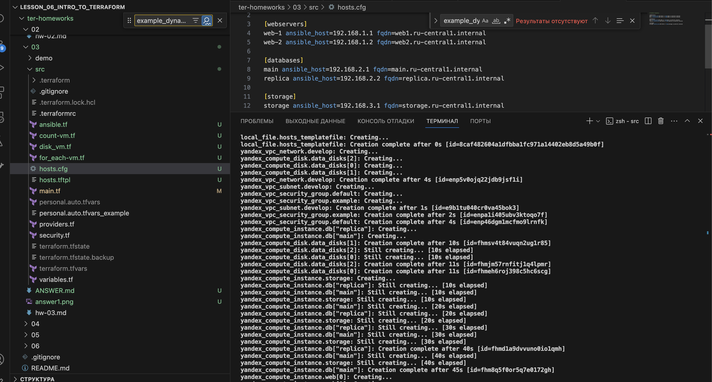
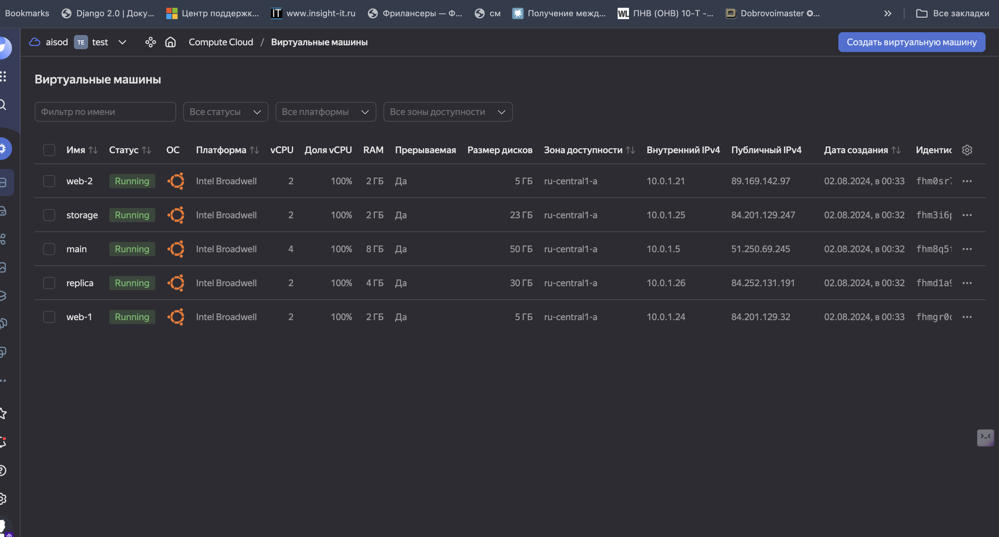

#### Задание #1

Итоговый результат:


#### Задание #2

Созданы файлы count-vm.tf и for_each-vm.tf в директории .\src Запуск и настройка виртуальных машин реализованы в соответствии с заданием.

#### Задание #3
1. В файле disk_vm.tf созданы 3 одинаковых виртуальных диска размером 1 Гб с помощью ресурса yandex_compute_disk и мета-аргумента count
2. Также создана одиночная ВМ c именем "storage" используя блок dynamic secondary_disk и мета-аргумент for_each

#### Задание #4

Через файл ansible.tf генерируется inventory-файл для ansible. Результат выполнения и общий запуск показаны на следующих скриншотах:

Итоговый результат:



#### Задание #5*

Задание: Напишите output, который отобразит ВМ из ваших ресурсов count и for_each в виде списка словарей...
Ответ: расположен в файле ./src/outputs.tf


#### Задание #7*
задание: Предложите выражение в terraform console, которое удалит из данной переменной 3 элемент из: subnet_ids и subnet_zones...
ответ:

```
  updated_vpc = {
    network_id = local.vpc.network_id
    subnet_ids = [for idx, id in local.vpc.subnet_ids : id if idx != 2]
    subnet_zones = [for idx, zone in local.vpc.subnet_zones : zone if idx != 2]
  }
```


