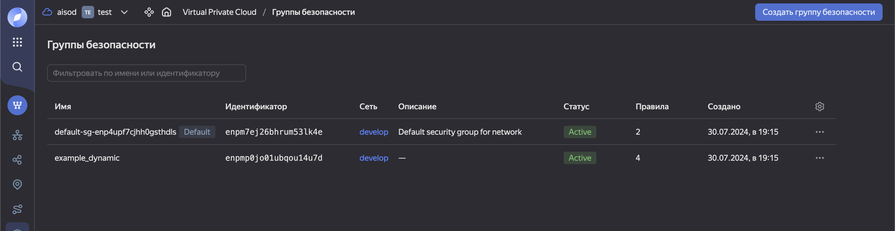

#### Задание #1

Итоговый результат:

#### Задание #2

Созданы файлы count-vm.tf и for_each-vm.tf в директории .\src Запуск и настройка виртуальных машин реализованы в соответствии с заданием.

#### Задание #3
1. В файле disk_vm.tf созданы 3 одинаковых виртуальных диска размером 1 Гб с помощью ресурса yandex_compute_disk и мета-аргумента count
2. Также создана одиночная ВМ c именем "storage" используя блок dynamic secondary_disk и мета-аргумент for_each

#### Задание #4

Через файл ansible.tf генерируется inventory-файл для ansible. Результат выполнения и общий запуск показаны на следующих скриншотах:

Итоговый результат:

